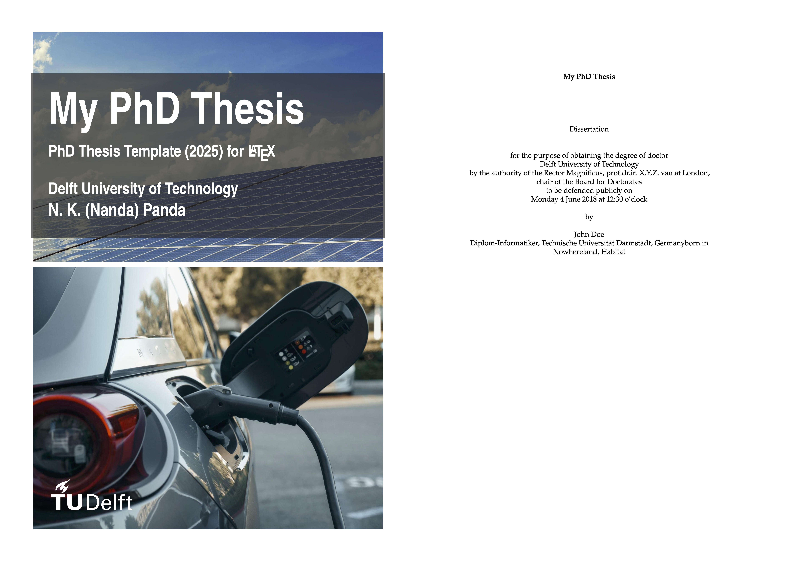

# TU Delft PhD Thesis Template (2025) for $\LaTeX$

This is an unofficial LaTeX template for writing a PhD thesis at TU Delft. It is based on the official TU Delft report class, but has been heavily modified to improve usability and to simplify customization. The template is designed to meet the requirements of the TU Delft house style as of 2025.

> **Note:** This template is not officially endorsed by TU Delft. Please check the latest guidelines from TU Delft for writing a PhD thesis, as they may change over time. But this can be a good starting point.

## Features

- Specifically designed for PhD thesises at TU Delft
- Clean and modern design
- Customizable title page
- Support for multiple languages (English and Dutch) for the title page
- Predefined commands for common elements (e.g., abstract, acknowledgements, etc.)
- Easy to use and modify
- Some styles to be used within chapters for keywords, definitions, theorems, etc.
- Support for including code snippets with syntax highlighting
- textbox environment for highlighting important information

This template is compatible with pdfLaTeX, XeLaTeX, and LuaLaTeX. To comply with the TU Delft house style, however, you should use either XeLaTeX or LuaLaTeX, since these engines support TrueType and OpenType fonts. The bibliography is handled with BibLaTeX, using biber as the backend.

## Acknowledgement

 The following template is mainly based on the report template by Daniel Zwanenveld, which can be found here [https://dzwaneveld.github.io/]( https://dzwaneveld.github.io/). You can also refer there for full documentation of the report class.

## Usage

This template can be used standalone in any LaTeX editor. Simply download the repository and open the `report.tex` file. You can then modify the content to fit your needs.
Also, you can copy the `tudreport.cls` file to your local LaTeX directory to use it in other projects.
Make sure to have the required packages installed. You can find a list of required packages in the `tudreport.cls` file. Moreover, you can use an online LaTeX editor like Overleaf and upload the files there.

Are you curios how the final result looks like? Have a look gere 

## Contribution
Contributions are very welcome! 🎉 If you spot any errors, typos, or formatting issues, feel free to correct them. You can also suggest or add new features to improve the template and make it more useful for others. Simply open an issue or submit a pull request; every contribution helps this template get better.

## License

This template is available under the MIT License. For more information, see [https://opensource.org/licenses/MIT](https://opensource.org/licenses/MIT)
